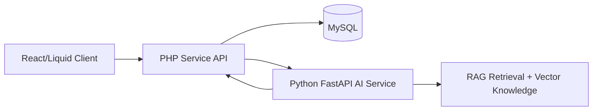

# Nguyễn Văn Uy Portfolio

Website portfolio hiện đại xây dựng bằng Next.js App Router, Tailwind CSS, Framer Motion và các component tái sử dụng theo phong cách Shadcn/UI.

## Tech Stack

- Next.js (App Router)
- Tailwind CSS
- Framer Motion
- Lucide Icons
- Reusable UI primitives (Shadcn style)

## Điểm nổi bật

- Dark-first UI with blue/cyan accent color
- Metadata chuẩn SEO + Open Graph + Twitter Card
- JSON-LD schema (`Person`) giúp tăng tín hiệu SEO
- Social preview image động qua `app/opengraph-image.tsx`
- Deep dive kỹ thuật cho dự án TruyenZ
- Terminal tương tác (`help`, `cat about_me.txt`, `stack`)
- Form liên hệ với API gửi mail an toàn phía server
- Responsive đầy đủ trên mobile và desktop

## Metrics Showcase (TruyenZ)

- AI RAG chatbot: `87%` response accuracy
- MySQL optimization: reduced query latency by `35%`
- Service decomposition with REST for scalability and maintainability

## Architecture Example (TruyenZ)



## Biến môi trường

Create `.env.local` from `.env.example`:

```bash
cp .env.example .env.local
```

Các biến cần cấu hình:

- `NEXT_PUBLIC_SITE_URL`: public domain for SEO metadata
- `NEXT_PUBLIC_GITHUB_URL`: profile/repo link shown on Hero section
- `NEXT_PUBLIC_CV_URL`: public link for CV download button
- `CONTACT_EMAIL`: contact email for future API route use
- `EMAIL_API_KEY`: Resend API key (server-side only)
- `EMAIL_FROM`: verified sender identity on Resend

`.gitignore` đã ignore `.env*` nên key bí mật không bị đẩy lên GitHub.

## Chạy local

```bash
nvm use 20.13.1
npm install
npm run dev
```

Truy cập [http://localhost:3000](http://localhost:3000).

## Deploy to Vercel

1. Push this project to GitHub.
2. Import repo in Vercel.
3. Add the same environment variables in Vercel Project Settings.
4. Deploy and enable automatic CI/CD on each push.

## GitHub + Vercel CI/CD Setup

```bash
git init
git add .
git commit -m "feat: build personal portfolio with contact API and SEO schema"
git branch -M main
git remote add origin https://github.com/<your-username>/<repo-name>.git
git push -u origin main
```

Then in Vercel:

1. `Add New Project` -> import your GitHub repository.
2. Framework preset: `Next.js`.
3. Add environment variables from `.env.local`.
4. Click `Deploy`.
5. Optional: add custom domain and update `NEXT_PUBLIC_SITE_URL`.

CLI alternative:

```bash
npx vercel login
npx vercel link
npx vercel --prod
```
